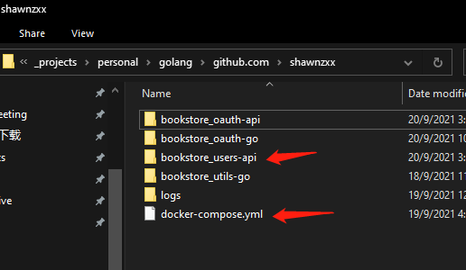

# bookstore_users-api

### set up local environment variables
Start app in local add your local environment: <br>
VSCode inside .vscode/launch.json <br>
GoLand use setting -> Go Modules -> Environment

### Run app on local

1. set up docker environment variables
   inside .env file

```text
DB_HOST=cassandra
ENV=dev
PORT=8080
LOG_OUTPUT=logs/logs.txt
LOG_LEVEL=debug
```

2. run app
```shell
go run ./src/main.go
```

### Run app on docker-compose
1. create compose file name as "docker-compose.yml" <br>
2. move it to the one layer up from your bookstore_users-api folder
   

3. yaml sample
```yaml

version: '3.9'
services:
  database:
    image: mysql:5.7
    #Specify a custom container name use for other service link to it
    container_name: "mysql"
    restart: always
    # use key value pair way writing enviroment value
    environment:
      MYSQL_DATABASE: 'users_db'
      # So you don't have to use root, but you can if you like
      MYSQL_USER: 'SA'
      # You can use whatever password you like
      MYSQL_PASSWORD: 'Passw0rd123!'
      # Password for root access
      MYSQL_ROOT_PASSWORD: 'Passw0rd123!'
    # <Port on hosted> : < Port running inside container>
    ports:
      - '3306:3306'
    # Opens port 3306 on the container, so inside container other service can connect to it
    expose:
      - '3306'
    # Where our data will be persisted
    volumes:
      - /c/mysql:/var/lib/mysql
  cassandra:
    image: "cassandra:latest"
    restart: always
    hostname: cassandra
    #Specify a custom container name, rather than a generated default name.
    container_name: "cassandra"
    ports:
      - "9042:9042"     # Expose native binary CQL port for your apps
    # use - way writing enviroment value
    environment:
      - MAX_HEAP_SIZE=256M
      - HEAP_NEWSIZE=128M
      # The default value is auto, which will set the listen_address option in cassandra.yaml to the IP address of the container as it starts.
      # This default should work in most use cases.
      - CASSANDRA_LISTEN_ADDRESS=auto
    volumes:
      - /c/cassandra:/var/lib/cassandra     # This is the volume that will persist data for cassandra
  users-api:
    # dockerfile location
    build: ./bookstore_users-api
    # image name we built
    image: bookstore_users-api:latest
    container_name: "users-api"
    depends_on:
      - database
    links:
      - database
      - oauth-api
    #暴露端口，但不映射到宿主机，只被内部其他服务连接访问
    expose:
      - "8081"
    #映射端口信息,宿主端口：容器端口 (即：HOST:CONTAINER) 的格式
    ports:
      - "8081:8081"
        #define running on isolated backend network
    # use environment section will auto replaced each of key's value using .env file which should placed inside the  same folder of docker-compose location
    # when you deploy to k8s make sure all pods have this .env file
    # you can run command "docker-compose config" to check if correct values were set
#    environment:
#      - MYSQL_USERS_USERNAME
#      - MYSQL_USERS_PASSWORD
#      - MYSQL_USERS_HOST
#      - MYSQL_USERS_SCHEMA
#      - ENV
#      - PORT
    # Or use env_file and point to the location of .env file
    # you can run command "docker-compose config" to check if correct values were set
    env_file:
      - ./bookstore_users-api/.env
    # here we mapped <log path on hosted> : <log path running inside container>
    # so when container is running we can see realtime log from host machine
    volumes:
      - ./logs:/app/logs
  oauth-api:
    build: ./bookstore_oauth-api
    image: bookstore_oauth-api:latest
    container_name: "oauth-api"
    depends_on:
      - cassandra
    links:
      - cassandra
    expose:
      - "8080"
    ports:
      - "8080:8080"
    env_file:
      - ./bookstore_oauth-api/.env
    volumes:
      - ./logs:/app/logs

```

4. run app on docker-compose
```shell
docker-compose up --build
```


